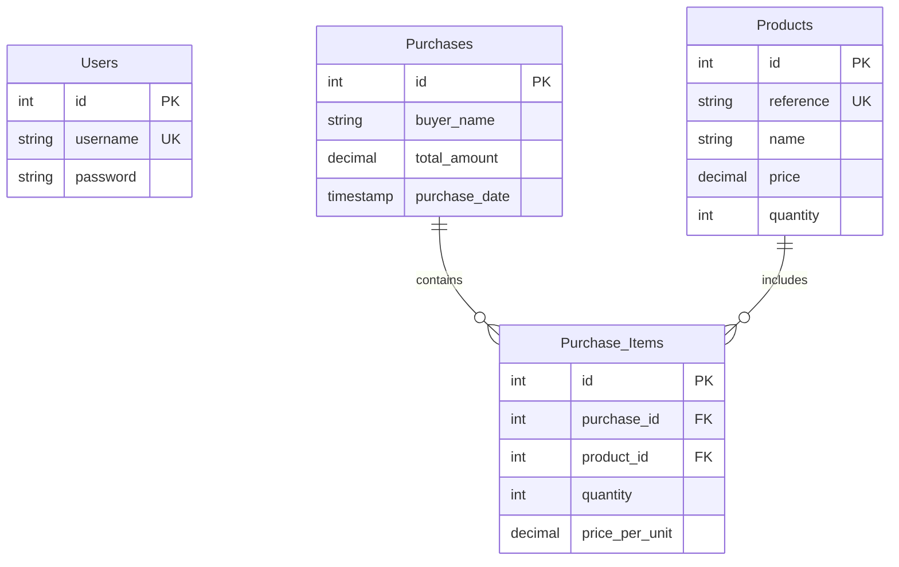

# توثيق نظام NANEF لإدارة المتجر

## نظرة عامة 🏪
نظام NANEF هو نظام متكامل لإدارة متجر الأدوات والمعدات. يوفر النظام واجهة مستخدم رسومية سهلة الاستخدام مع قاعدة بيانات قوية لإدارة المخزون والمبيعات.

## المكونات الرئيسية 🔧

### 1. نظام تسجيل الدخول 🔐
يتم التحكم في الوصول إلى النظام من خلال نافذة تسجيل الدخول المصممة باستخدام CustomTkinter. تتميز الواجهة بما يلي:
- تصميم عصري مع خلفية أنيقة
- حقول إدخال لاسم المستخدم وكلمة المرور
- خيار "تذكرني"
- روابط "نسيت كلمة المرور" و "تسجيل حساب جديد"

```python
# مثال على كود تسجيل الدخول
def login(self):
    username = self.username_entry.get().strip()
    password = self.password_entry.get()
    
    if not username or not password:
        messagebox.showwarning("تنبيه", "الرجاء ملء جميع الحقول")
        return
```

### 2. قاعدة البيانات 💾
يستخدم النظام قاعدة بيانات MySQL لتخزين جميع البيانات. فيما يلي مخطط قاعدة البيانات:



#### وصف الجداول:
1. **Users**: يخزن بيانات المستخدمين
   - id: معرف فريد
   - username: اسم المستخدم (فريد)
   - password: كلمة المرور

2. **Products**: يخزن بيانات المنتجات
   - id: معرف فريد
   - reference: رقم مرجعي للمنتج
   - name: اسم المنتج
   - price: السعر
   - quantity: الكمية المتوفرة

3. **Purchases**: يخزن بيانات المشتريات
   - id: معرف فريد
   - buyer_name: اسم المشتري
   - total_amount: المبلغ الإجمالي
   - purchase_date: تاريخ الشراء

4. **Purchase_Items**: يخزن تفاصيل المشتريات
   - id: معرف فريد
   - purchase_id: معرف المشتراة
   - product_id: معرف المنتج
   - quantity: الكمية
   - price_per_unit: السعر لكل وحدة

### 3. إعداد قاعدة البيانات 🔧
يتم إنشاء قاعدة البيانات وتهيئتها تلقائياً عند بدء التشغيل:

```python
def setup_database():
    # إنشاء قاعدة البيانات
    cursor.execute("CREATE DATABASE IF NOT EXISTS hardware_store")
    
    # إنشاء الجداول
    cursor.execute("""
        CREATE TABLE IF NOT EXISTS users (
            id INT AUTO_INCREMENT PRIMARY KEY,
            username VARCHAR(255) NOT NULL UNIQUE,
            password VARCHAR(255) NOT NULL
        )
    """)
    # ... باقي الجداول
```

### 4. الاتصال بقاعدة البيانات 🔌
يتم إدارة الاتصال بقاعدة البيانات من خلال دالة مخصصة:

```python
def get_db_connection():
    try:
        conn = mysql.connector.connect(
            host="localhost",
            user="root",
            password="0000",
            database="hardware_store"
        )
        return conn
    except mysql.connector.Error as err:
        messagebox.showerror("خطأ في قاعدة البيانات", f"لا يمكن الاتصال بقاعدة البيانات: {err}")
        return None
```

## المميزات الرئيسية ⭐

1. **واجهة مستخدم حديثة**
   - تصميم عصري وأنيق
   - سهولة الاستخدام
   - تجربة مستخدم سلسة

2. **إدارة المخزون**
   - تتبع المنتجات
   - إدارة الكميات
   - تحديث الأسعار

3. **نظام المبيعات**
   - تسجيل المبيعات
   - تتبع المشتريات
   - تقارير المبيعات

4. **الأمان**
   - نظام تسجيل دخول آمن
   - صلاحيات المستخدمين
   - حماية البيانات

## المتطلبات التقنية 💻

1. **لغات البرمجة والأطر**
   - Python 3.x
   - CustomTkinter
   - MySQL

2. **المكتبات المطلوبة**
   - mysql-connector-python
   - Pillow (PIL)
   - tkinter

3. **قاعدة البيانات**
   - MySQL Server
   - قاعدة بيانات hardware_store

## إرشادات التثبيت 📥

1. تثبيت Python 3.x
2. تثبيت المكتبات المطلوبة:
   ```bash
   pip install mysql-connector-python
   pip install customtkinter
   pip install Pillow
   ```
3. إعداد قاعدة البيانات MySQL
4. تشغيل البرنامج:
   ```bash
   python main.py
   ```

## الهيكل التنظيمي للمشروع 📁

```
Projet GL/
├── auth/
│   └── login.py
├── database/
│   ├── db_config.py
│   └── seed_data.py
├── static/
│   ├── login(3).PNG
│   └── nour.jpg
├── main.py
└── requirements.txt
```

## التطويرات المستقبلية 🚀

1. إضافة نظام تسجيل مستخدمين جديد
2. تحسين نظام استعادة كلمة المرور
3. إضافة لوحة تحكم للمشرف
4. تحسين تقارير المبيعات
5. إضافة نظام تنبيهات للمخزون المنخفض
